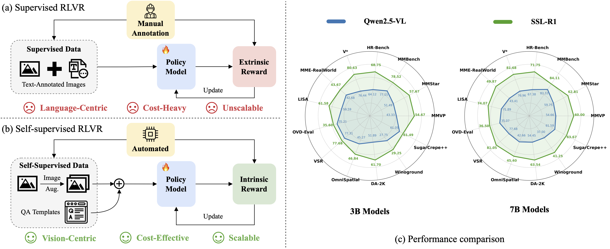

<div align="center">

<h1>SSL-R1: Self-Supervised Visual Reinforcement Post-Training for Multimodal Large Language Models</h1>

<div>
    <a href='https://jiahao000.github.io/' target='_blank'>Jiahao Xie</a><sup>1,2</sup>&emsp;
    <a href='https://alessiotonioni.github.io/' target='_blank'>Alessio Tonioni</a><sup>3</sup>&emsp;
    <a href='https://scholar.google.com/citations?user=OglqhoUAAAAJ&hl=en' target='_blank'>Nathalie Rauschmayr</a><sup>3</sup>&emsp;
    <a href='https://federicotombari.github.io/' target='_blank'>Federico Tombari</a><sup>3</sup>&emsp;
    <a href='https://scholar.google.com/citations?user=z76PBfYAAAAJ&hl=en' target='_blank'>Bernt Schiele</a><sup>1,2</sup>
</div>
<div>
    <sup>1</sup>Max Planck Institute for Informatics&emsp;
    <sup>2</sup>VIA Research Center&emsp;
    <sup>3</sup>Google
</div>

<div>
    <strong>arXiv 2026</strong>
</div>

<div>
    <h4 align="center">
        <a href="https://arxiv.org/abs/xxxx.xxxxx" target='_blank'>
        
        </a>
        <a href="https://github.com/Jiahao000/SSL-R1" target='_blank'>
        
        </a>
        <a href="https://github.com/Jiahao000/SSL-R1#-citation" target='_blank'>
        
        </a>
    </h4>
</div>

<strong>We present SSL-R1, a generic self-supervised RL post-training framework that derives intrinsically verifiable rewards from input images. SSL-R1 is vision-centric, cost-effective, and scalable, requiring neither human nor external model supervision.</strong>

<div style="text-align:center">

</div>

🤩 <ins>Key Properties</ins>

<html>
    <table style="margin-left: auto; margin-right: auto;">
        <tr>
            <td>
                <li>Covers multiple SSL tasks</li> 
                <li>Supports one-time and one-stage training</li>
                <li>Transferable to broad downstream tasks</li>
            </td>
        </tr>
    </table>
</html>

📖 For more results, please refer to our <a href="https://arxiv.org/abs/xxxx.xxxxx" target="_blank">paper</a>

---

</div>

## 📣 News
- [04/2026] 🔥 SSL-R1 is released on [arXiv](https://arxiv.org/abs/xxxx.xxxxx).

## 🌟 Method

SSL-R1 is a <i>generic</i> self-supervised RL-based post-training framework. We re-purpose five different self-supervised tasks widely used in the vision literature as examples amenable to being used within an RLVR framework, targeting different aspects of visual information and providing comprehensive coverage of vision-centric reasoning capabilities.

<div style="text-align:center">

</div>

## 🥰 Qualitative Examples

We provide some qualitative examples of the baseline model (Qwen2.5-VL-7B) vs. our SSL-R1 on three types of vision-centric multimodal benchmarks.

<div style="text-align:center">

</div>

## 📘 Citation

If you find this work useful for your research, please consider citing our paper:

```bibtex
@inproceedings{xie2026sslr1,
  title = {SSL-R1: Self-Supervised Visual Reinforcement Post-Training for Multimodal Large Language Models},
  author = {Xie, Jiahao and Tonioni, Alessio and Rauschmayr, Nathalie and Tombari, Federico and Schiele, Bernt},
  journal={arXiv},
  year = {2026}
}
```